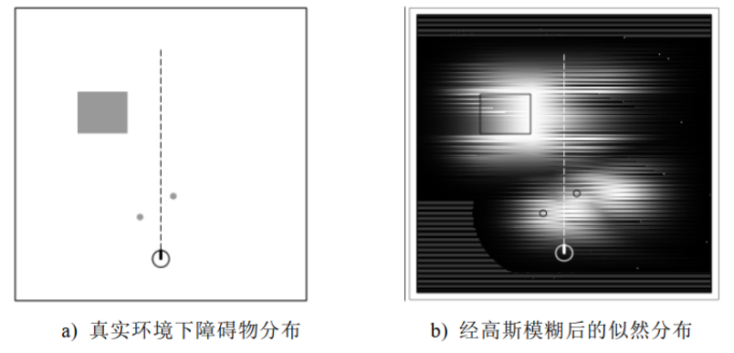

# 基于优化的前端代码解析

*主要看一下似然场地图是如何生成的。*

## 一、概述

## 二、代码解读

### 1、整体流程

​	激光雷达信息回调函数中，我们可以清晰地看到整体的流程：注释中讲解

```c++
void rosLaserScanCallback(const sensor_msgs::LaserScanConstPtr& msg)
{
    static bool isFirstFrame = true;
    Eigen::Vector3d nowPose;
    if(getOdomPose(msg->header.stamp,nowPose) == false)
    {
        std::cout <<"Failed to get Odom Pose"<<std::endl;
        return ;
    }
	
    //若是第一帧，则不计算位姿，直接设定位置。
    if(isFirstFrame == true)
    {
        std::cout <<"First Frame"<<std::endl;
        isFirstFrame = false;

        m_prevLaserPose = nowPose;
        ConvertChampionLaserScanToEigenPointCloud(msg,m_prevPts);

        m_odomPath.push_back(nowPose);
        m_gaussianNewtonPath.push_back(nowPose);

        return ;
    }

    auto pre_odom_pose = m_odomPath.back();
    double delta_dist2 = std::pow(nowPose(0) - pre_odom_pose(0),2) + std::pow(nowPose(1) - pre_odom_pose(1),2);
    double delta_angle = std::fabs(tfNormalizeAngle(nowPose(2) - pre_odom_pose(2)));
    if(delta_dist2 < 0.2 * 0.2 &&
       delta_angle < tfRadians(10.0))
    {
        std::cout<<"1"<<std::endl;
        return ;
    }
    //数据类型转换．
    std::vector<Eigen::Vector2d> nowPts;
    ConvertChampionLaserScanToEigenPointCloud(msg,nowPts);
    //生成地图
    map_t* map = CreateMapFromLaserPoints(m_prevLaserPose,m_prevPts,0.1);

    //进行优化．
    //初始解为上一帧激光位姿+运动增量
    
    //计算运动增量，当前估计-上一帧位姿
    Eigen::Vector3d deltaPose = nowPose - m_odomPath.back();
    deltaPose(2) = GN_NormalizationAngle(deltaPose(2));

    Eigen::Matrix3d R_laser;
    double theta = m_prevLaserPose(2);
    R_laser << cos(theta), -sin(theta), 0, 
    sin(theta),  cos(theta), 0,
    0,          0,      1;

    Eigen::Matrix3d R_odom;
    theta = m_odomPath.back()(2);
    R_odom << cos(theta), -sin(theta), 0, 
    sin(theta),  cos(theta), 0,
    0,          0,      1;
    
    //初始解：上一帧激光位姿+运动增量
    Eigen::Vector3d finalPose = m_prevLaserPose + R_laser * R_odom.transpose() * deltaPose;
    finalPose(2) = GN_NormalizationAngle(finalPose(2));

    //这里的finalpose是最终算出的初始位姿，扔到GNOptimization函数中优化
    std::cout << "Init Pose:" << finalPose.transpose() << std::endl;
    GaussianNewtonOptimization(map,finalPose,nowPts);

    //更新数据．
    m_prevLaserPose = finalPose;
    m_prevPts = nowPts;

    std::cout <<"Final Pose:"<<finalPose.transpose()<<std::endl<< std::endl;


    //释放地图
    map_free(map);

    //保存路径．
    m_odomPath.push_back(nowPose);
    m_gaussianNewtonPath.push_back(finalPose);

    PublishPath(m_odomPub,m_odomPath);
    PublishPath(m_gaussianNewtonPub,m_gaussianNewtonPath);
}
```

​	可以看出：函数`GaussianNewtonOptimization`是优化最主要的函数。接下来，我们分析这个函数。

### 2、优化流程

​	*分析函数`GaussianNewtonOptimization`*

```c++
/**
 * @brief GaussianNewtonOptimization
 * 进行高斯牛顿优化．
 * @param map
 * @param init_pose
 * @param laser_pts
 */
void GaussianNewtonOptimization(map_t*map,Eigen::Vector3d& init_pose,std::vector<Eigen::Vector2d>& laser_pts)
{
    int maxIteration = 10;
    Eigen::Vector3d now_pose = init_pose;

    for(int i = 0; i < maxIteration;i++)
    {
        //TODO
        //compute H and b
        Eigen::Matrix3d H;
        Eigen::Vector3d b;
        ComputeHessianAndb(map,now_pose,laser_pts,H,b);
        Eigen::Vector3d deltaT = Eigen::Vector3d::Zero();
        //deltaT = H.inverse()*b;
        deltaT = H.ldlt().solve(b)*0.01;
        now_pose = now_pose +deltaT;
        if(deltaT.norm()<0.0001)
        {
            break;
        }
        //END OF TODO
    }
    init_pose = now_pose;
}
```

**分析优化整体流程：**

​	手动优化，我们需要解出线性方程组的H 和 b 来得到待优化变量的一步增量。

#### i. H矩阵以及b的求解

```c++
/**
 * @brief ComputeCompleteHessianAndb
 * 计算H*dx = b中的H和b
 * @param map
 * @param now_pose
 * @param laser_pts
 * @param H
 * @param b
 */
void ComputeHessianAndb(map_t* map, Eigen::Vector3d now_pose,
                        std::vector<Eigen::Vector2d>& laser_pts,
                        Eigen::Matrix3d& H, Eigen::Vector3d& b)
{
    H = Eigen::Matrix3d::Zero();
    b = Eigen::Vector3d::Zero();
    //TODO
    int nLaserPtNum=laser_pts.size();
    for(int i=0;i<nLaserPtNum;i++)
    {
        //dM
        Eigen::Vector2d xyPt=laser_pts[i];
        Eigen::Matrix3d T=GN_V2T(now_pose);
        Eigen::Vector2d ST=GN_TransPoint(xyPt,T);
        Eigen::Vector3d MdM=InterpMapValueWithDerivatives(map,ST);
        //dS/dT
        Eigen::Matrix<double,2,3> dSdT;
        double t1,t2;
        t1=-sin(now_pose(2))*xyPt(0)-cos(now_pose(2))*xyPt(1);
        t2=cos(now_pose(2))*xyPt(0)-sin(now_pose(2))*xyPt(1);
        dSdT<<1.0,0.0,t1;0.0,1.0,t2;
        //sum
        Eigen::Matrix3d deltaH;
        Eigen::Vector3d deltab;
        Eigen::Vector2d dM;
        double Mst;
        dM<<MdM(1),MdM(2);
        Mst=MdM(0);
        deltaH=(dM.transpose()*dSdT).transpose()*(dM.transpose()*dSdT);
        H=H+deltaH;

        deltab=(dM.transpose()*dSdT).transpose()*(1-Mst);
        b=b+deltab;
    }
    //END OF TODO
}
```

#### ii. 势场的插值计算

```c++
/**
 * @brief InterpMapValueWithDerivatives
 * 在地图上的进行插值，得到coords处的势场值和对应的关于位置的梯度．
 * 返回值为Eigen::Vector3d ans
 * ans(0)表示市场值
 * ans(1:2)表示梯度
 * @param map
 * @param coords
 * @return
 */
Eigen::Vector3d InterpMapValueWithDerivatives(map_t* map,Eigen::Vector2d& coords)
{
    Eigen::Vector3d ans;
    //TODO
    int x0=map->size_x/2.0+floor((coords(0)-map->origin_x)/map->resolution);
    int y0=map->size_y/2.0+floor((coords(1)-map->origin_y)/map->resolution);

    double P00,P10,P01,P11;
    P00=map->cells[MAP_INDEX(map,x0,y0)].score;
    P10=map->cells[MAP_INDEX(map,x0+1,y0)].score;
    P01=map->cells[MAP_INDEX(map,x0,y0+1)].score;
    P11=map->cells[MAP_INDEX(map,x0+1,y0+1)].score;
    double u,v;
    u=(coords(0)-map->origin_x)/map->resolution+map->size_x/2.0-(double)x0;
    v=(coords(1)-map->origin_y)/map->resolution+map->size_y/2.0-(double)y0;

    ans(0)=P00*(1-u)*(1-v)+P10*u*(1-v)+P11*u*v+P01*(1-u)*v;
    ans(1)=(v*(P11-P01)+(1-v)*(P01-P00))/map->resolution;
    ans(2)=(u*(P11-P01)-(1-u)*(P01-P00))/map->resolution;
    //END OF TODO

    return ans;
}
```

### 3、势场地图的创建

```c++
//用激光雷达数据创建势场．
map_t* CreateMapFromLaserPoints(Eigen::Vector3d map_origin_pt,
                                std::vector<Eigen::Vector2d> laser_pts,
                                double resolution)
{
    map_t* map = map_alloc();

    map->origin_x = map_origin_pt(0);
    map->origin_y = map_origin_pt(1);
    map->resolution = resolution;

    //固定大小的地图，必要时可以扩大．
    map->size_x = 10000;
    map->size_y = 10000;

    map->cells = (map_cell_t*)malloc(sizeof(map_cell_t)*map->size_x*map->size_y);

    //高斯平滑的sigma－－固定死
    map->likelihood_sigma = 0.5;

    Eigen::Matrix3d Trans = GN_V2T(map_origin_pt);

    //设置障碍物
    for(int i = 0; i < laser_pts.size();i++)
    {
        Eigen::Vector2d tmp_pt = GN_TransPoint(laser_pts[i],Trans);

        int cell_x,cell_y;
        cell_x = MAP_GXWX(map,tmp_pt(0));
        cell_y = MAP_GYWY(map,tmp_pt(1));

        map->cells[MAP_INDEX(map,cell_x,cell_y)].occ_state = CELL_STATUS_OCC;
    }

    //进行障碍物的膨胀--最大距离固定死．
    map_update_cspace(map,0.5);

    return map;
}
```

### 4、似然场地图模型	

​	**根据每次激光雷达数据在地图中更新(构建)地图，激光雷达检测到的点云认为是障碍物(有高斯噪声的)。**因此，若检测到地图坐标系下(x,y)为障碍物，**则在此点设置为障碍，值+1，再进行高斯膨胀**(以该点为均值，以一个固定值为方差的高斯分布)。这样我们每次获得激光雷达数据都可以对似然场地图进行更新。

​	**优化过程：找到一个最优位姿，使得测量的每一个点在似然场中的得分最高。**

​	个人分析：上一句话的意思是，似然场中得分高的位置认为是障碍物，那么得到新的一帧数据后，最最理想的情况是没有误差，得到的激光雷达点云完全符合似然场地中高分地段。但是这一般来讲不可能，因此优化求最大值。

​	*一般优化都是求最小，因此求(1-得分)^2即可*




