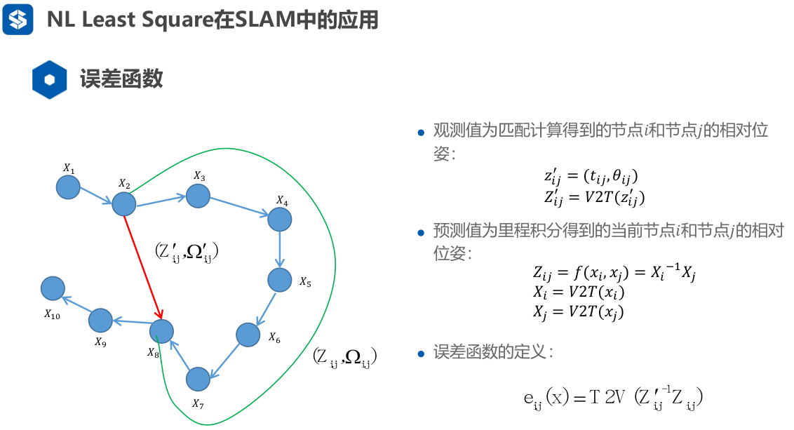

# 基于图优化的后端代码分析

## 一、概述

*主要搞一下LM或GN求解BA的过程。很重要*

### 1、误差的构建



**观测值为回环检测匹配得到的相对位姿。**

**预测值为里程计积分得到的当前节点i和节点j的相对位姿。**

​	观测值与预测值理论上来讲应该是一样的(完全没有误差，里程计准确、激光雷达准确、匹配准确)。但是由于传感器通常存在误差，且匹配算法中也可能有误匹配，因此我们定义误差函数为这两个相对位姿的“差”：
$$
e_{ij}(x)=TransToVector(Z_{ij}^{'-1}Z_{ij})
$$
*其中，函数TransToVector是将变换矩阵转为向量*

### 2、非线性优化

​	求误差对优化变量(位姿)的雅可比，再进行迭代。推导可以见ppt。

*激光slam中由于二维定位，变换矩阵较为简单，求导容易；视觉slam中需要借助李代数知识进行求导。*

## 二、代码分析

### 1、main函数->寻找数据入口

```c++
int main(int argc, char **argv)
{
    ros::init(argc, argv, "ls_slam");

    ros::NodeHandle nodeHandle;

    // beforeGraph
    ros::Publisher beforeGraphPub,afterGraphPub;
    beforeGraphPub = nodeHandle.advertise<visualization_msgs::MarkerArray>("beforePoseGraph",1,true);
    afterGraphPub  = nodeHandle.advertise<visualization_msgs::MarkerArray>("afterPoseGraph",1,true);

    std::string VertexPath = "/home/gzh/lidar_slam_HW/HW6/LSSLAMProject/src/ls_slam/data/test_quadrat-v.dat";
    std::string EdgePath = "/home/gzh/lidar_slam_HW/HW6/LSSLAMProject/src/ls_slam/data/test_quadrat-e.dat";

    std::vector<Eigen::Vector3d> Vertexs;
    std::vector<Edge> Edges;

    ReadVertexInformation(VertexPath,Vertexs);
    ReadEdgesInformation(EdgePath,Edges);

    PublishGraphForVisulization(&beforeGraphPub,
                                Vertexs,
                                Edges);

    double initError = ComputeError(Vertexs,Edges);
    std::cout <<"initError:"<<initError<<std::endl;

    int maxIteration = 100;
    double epsilon = 1e-4;

    //这里开始优化，前面都是读数据+计算初始误差
    for(int i = 0; i < maxIteration;i++)
    {
        std::cout <<"Iterations:"<<i<<std::endl;
        //这个函数是解最小二乘函数！！！
        //可以求出每个节点的增量dx
        Eigen::VectorXd dx = LinearizeAndSolve(Vertexs,Edges);

        //进行更新
        //TODO--Start
        for(int i=0;i<Vertexs.size();i++)
        {
            Vertexs[i]+=Eigen::Vector3d(dx(3*i),dx(3*i+1),dx(3*i+2));
        }
        //TODO--End

        //计算当前增量，
        //如果最大增量小于某个设定值，则不再优化
        double maxError = -1;
        for(int k = 0; k < 3 * Vertexs.size();k++)
        {
            if(maxError < std::fabs(dx(k)))
            {
                maxError = std::fabs(dx(k));
            }
        }

        if(maxError < epsilon)
            break;
    }

    double finalError  = ComputeError(Vertexs,Edges);

    std::cout <<"FinalError:"<<finalError<<std::endl;

    PublishGraphForVisulization(&afterGraphPub,
                                Vertexs,
                                Edges,1);

    ros::spin();

    return 0;
}
```

​	通过上述分析，我们可以看到，主要求解函数为：`LinearizeAndSolve`；计算误差函数为：`ComputeError`。接下来我们主要分析下述函数：

### 2、求解函数LinearizeAndSolve

```c++
/**
 * @brief LinearizeAndSolve
 *        高斯牛顿方法的一次迭代．
 * @param Vertexs   图中的所有节点
 * @param Edges     图中的所有边
 * @return          位姿的增量
 */
Eigen::VectorXd  LinearizeAndSolve(std::vector<Eigen::Vector3d>& Vertexs,
                                   std::vector<Edge>& Edges)
{
    //申请内存
    Eigen::MatrixXd H(Vertexs.size() * 3,Vertexs.size() * 3);
    Eigen::VectorXd b(Vertexs.size() * 3);

    H.setZero();
    b.setZero();

    //固定第一帧
    Eigen::Matrix3d I;
    I.setIdentity();
    H.block(0,0,3,3) += I;

    //构造H矩阵　＆ b向量
    for(int i = 0; i < Edges.size();i++)
    {
        //提取信息
        Edge tmpEdge = Edges[i];
        Eigen::Vector3d xi = Vertexs[tmpEdge.xi];
        Eigen::Vector3d xj = Vertexs[tmpEdge.xj];
        Eigen::Vector3d z = tmpEdge.measurement;
        Eigen::Matrix3d infoMatrix = tmpEdge.infoMatrix;

        //计算误差和对应的Jacobian
        Eigen::Vector3d ei;
        Eigen::Matrix3d Ai;
        Eigen::Matrix3d Bi;
        CalcJacobianAndError(xi,xj,z,ei,Ai,Bi);

        //TODO--Start
        Eigen::MatrixXd dH(Vertexs.size()*3,Vertexs.size()*3);
        Eigen::VectorXd db(Vertexs.size() * 3);

        dH.setZero();
        db.setZero();
		
        //H为Hessian矩阵
        //b为方程组右侧向量，可以认为是残差
       	dH.block(3*tmpEdge.xi,3*tmpEdge.xi,3,3)=Ai.transpose()*infoMatrix*Ai;
        dH.block(3*tmpEdge.xi,3*tmpEdge.xj,3,3)=Ai.transpose()*infoMatrix*Bi;
        dH.block(3*tmpEdge.xj,3*tmpEdge.xi,3,3)=Bi.transpose()*infoMatrix*Ai;
        dH.block(3*tmpEdge.xj,3*tmpEdge.xj,3,3)=Bi.transpose()*infoMatrix*Bi;

        db.block(3*tmpEdge.xi,0,3,1)=Ai.transpose()*infoMatrix*ei;
        db.block(3*tmpEdge.xj,0,3,1)=Bi.transpose()*infoMatrix*ei;

        H+=dH;
        b+=db;
        //TODO--End
    }

    //求解
    Eigen::VectorXd dx;

    //TODO--Start
    //个人认为此处求解应使用BA中的稀疏求解方法
    //这里若节点数量增加，则维度大幅提升，解方程速度大大降低
    dx=-H.colPivHouseholderQr().solve(b);
    //TODO-End

    return dx;
}
```

### 3、雅可比以及误差计算函数CalcJacobianAndError

```c++
/**
 * @brief CalcJacobianAndError
 *         计算jacobian矩阵和error
 * @param xi    fromIdx
 * @param xj    toIdx
 * @param z     观测值:xj相对于xi的坐标
 * @param ei    计算的误差
 * @param Ai    相对于xi的Jacobian矩阵
 * @param Bi    相对于xj的Jacobian矩阵
 */
void CalcJacobianAndError(Eigen::Vector3d xi,Eigen::Vector3d xj,Eigen::Vector3d z,
                          Eigen::Vector3d& ei,Eigen::Matrix3d& Ai,Eigen::Matrix3d& Bi)
{
    //这里见ppt中雅可比的求解即可
    //TODO--Start
    Eigen::Matrix3d Xi=PoseToTrans(xi);
    Eigen::Matrix3d Xj=PoseToTrans(xj);
    Eigen::Matrix3d Xij=Xi.inverse()*Xj;
    Eigen::Matrix3d Tij=PoseToTrans(z);

    Eigen::Matrix2d Rij=Xij.block(0,0,2,2);
    Eigen::Matrix2d Ri=Xi.block(0,0,2,2);
    Eigen::Matrix2d Rj=Xj.block(0,0,2,2);
    Eigen::Vector2d tij=Tij.block(0,2,2,1);
    Eigen::Vector2d ti=xi.block(0,0,2,1);
    Eigen::Vector2d tj=xj.block(0,0,2,1);

    Bi.setZero();
    Bi.block(0,0,2,2)=Rij.transpose()*Ri.transpose();
    Bi(2,2)=1.0;

    Eigen::Matrix2d dRiDt=Eigen::Matrix2d::Zero();
    //double theta = atan2(Ri(1,0),Ri(0,0));
    dRiDt<<-sin(xi(2)),cos(xi(2)),-cos(xi(2)),-sin(xi(2));
    Ai.setZero();
    Ai.block(0,0,2,2)=-Rij.transpose()*Ri.transpose();
    Ai(2,2)=-1.0;
    Ai.block(0,2,2,1)=Rij.transpose()*dRiDt*(tj-ti);

    Eigen::Vector3d xij=TransToPose(Xij);
    ei.block(0,0,2,1)=Rij.transpose()*(Ri.transpose()*(tj-ti)-tij);
    ei(2)=xj(2)-xi(2)-z(2);
    ei(2)=GN_NormalizationAngle(ei(2));
    //TODO--end
}
```

### 4、全图误差计算函数ComputeError

```c++
//计算整个pose-graph的误差
double ComputeError(std::vector<Eigen::Vector3d>& Vertexs,
                    std::vector<Edge>& Edges)
{
    double sumError = 0;
    for(int i = 0; i < Edges.size();i++)
    {
        Edge tmpEdge = Edges[i];
        Eigen::Vector3d xi = Vertexs[tmpEdge.xi];
        Eigen::Vector3d xj = Vertexs[tmpEdge.xj];
        Eigen::Vector3d z = tmpEdge.measurement;
        Eigen::Matrix3d infoMatrix = tmpEdge.infoMatrix;

        Eigen::Matrix3d Xi = PoseToTrans(xi);
        Eigen::Matrix3d Xj = PoseToTrans(xj);
        Eigen::Matrix3d Z  = PoseToTrans(z);

        Eigen::Matrix3d Ei = Z.inverse() *  Xi.inverse() * Xj;

        Eigen::Vector3d ei = TransToPose(Ei);


        sumError += ei.transpose() * infoMatrix * ei;
    }
    return sumError;
}
```

