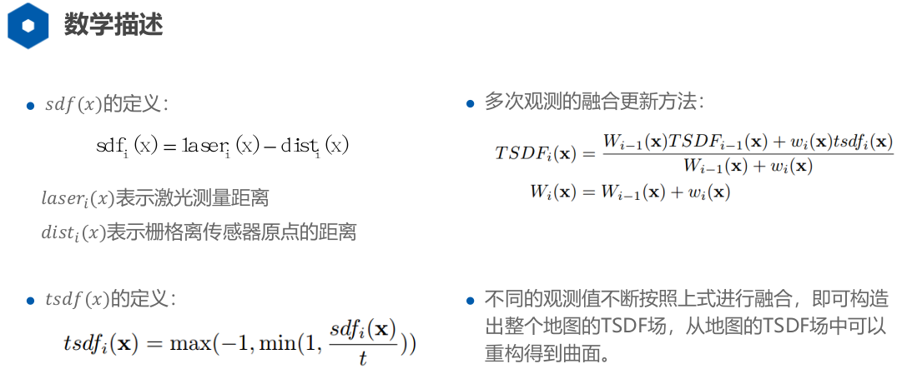

# 基于已知位姿的建图

## 一、概述

*完成对三种建图算法的理解与应用*

### 1、覆盖栅格建图算法

*数学推导见ppt*

​	这里说一下该算法的理解：首先确定地图上的先验值(一个固定常数)，则该栅格为障碍的概率计算方法为：
$$
l(m_i|x_{1:t},z_{1:t})=l(m_i|z_t,x_t)+l(m_i|z_{1:t-1},x_{1,t-1})-l(m_i)
$$
*这里l(x)表示log(p(x))*

这个公式很容易理解：

- **每次根据当前位置和当前激光雷达观测信息可以得到哪些栅格被占据，哪些没有被占据——即位l(mi|zt,xt)。**
- 公式右侧第二项是根据t时刻之前的所有信息估计到的mi的值，**这只需要对地图上每一个栅格值累加(减)即可**
- 第三项是先验值，固定。**本例中，0为完全free；100为完全occupied。先验值设定为50。**

这里给一下激光雷达逆观测模型：


### 2、计数(Count Model)建图算法

*数学推导见ppt*


### 3、TSDF建图算法

参考：https://blog.csdn.net/shoufei403/article/details/103574858

参考：激光SLAM理论与实践ppt

**要高清楚多次观测的融合更新方法是怎么来的**




​	多次观测融合更新方法：**离机器人自身较进且非障碍物的点的sdf值大，值不会大于1；离障碍物近(激光雷达测量距离附近)的点sdf值小；在障碍物后面的点一般为负数，不会比-1再小。**这样不断根据给定的权重wi来更新整个TSDF场，最后障碍物在场值为0的点处。如下所示：


## 二、代码分析

### 1、覆盖栅格建图算法

```c++
//在循环中运行下列程序，遍历所有激光信息和机器人位姿

GridIndex beamPointIndex = ConvertWorld2GridIndex(world_x,world_y);
std:: vector<GridIndex> tempGridIndex;
tempGridIndex=TraceLine(robotIndex.x,robotIndex.y,beamPointIndex.x,beamPointIndex.y);

//看激光雷达测的数据点，若距离小于15，则认为扫到了障碍物
//若距离大于15，则认为  该点  是free的
if(isValidGridIndex(beamPointIndex))
{
    int gridIndex = GridIndexToLinearIndex(beamPointIndex);
    if(dist>=15.0)
    {
        pMap[gridIndex]+=mapParams.log_free;
        if(pMap[gridIndex]<0)
        {
            pMap[gridIndex]=0;
        }                 
    }
    else
    {
        pMap[gridIndex]+=mapParams.log_occ;
        if(pMap[gridIndex]>=100)
        {
            pMap[gridIndex]=100;
        }                       
    }
}
else
{
    std::cout<<"Invalid beam Point Index"<<std::endl;
}

//对于扫到障碍物之前的所有点，以及空闲点的之前所有点，都认为被激光穿过
//因此是free的
for(int i=0;i<tempGridIndex.size();i++)
{
    GridIndex t=tempGridIndex[i];
    if(isValidGridIndex(t))
    {
        int tInd=GridIndexToLinearIndex(t);
        pMap[tInd]+=mapParams.log_free;
        if(pMap[tInd]<0)
        {
            pMap[tInd]=0;
        }
    }
    else
    {
        std::cout<<"Invalid Index"<<std::endl;
    }
}
```

### 2、计数建图算法

```c++
//循环中运行此部分代码

GridIndex beamPointIndex = ConvertWorld2GridIndex(world_x,world_y);
std::vector<GridIndex> vPassPoint = TraceLine(robotIndex.x,robotIndex.y,beamPointIndex.x,beamPointIndex.y);
//每个格子计算misses以及hits
for(int i=0;i<vPassPoint.size();i++)
{
    GridIndex tInd=vPassPoint[i];
    if(isValidGridIndex(tInd))
    {
        int mInd = GridIndexToLinearIndex(tInd);
        pMapMisses[mInd]++;
    }
}
if(isValidGridIndex(beamPointIndex))
{
    int bInd = GridIndexToLinearIndex(beamPointIndex);
    pMapHits[bInd]++;
}
```

地图构建：

```c++
//计算每个栅格是否为障碍物，超过一定阈值则认为是

for (int i = 0; i < mapParams.width * mapParams.height; i++)
{
    if(pMapHits[i]+pMapMisses[i]==0)
    {
        continue;
    }
    pMapW[i]=(double)pMapHits[i]/(pMapHits[i]+pMapMisses[i])*100;
    if(pMapW[i]>=20)
        pMap[i]=100;
}
```

### 3、TSDF

#### i. 更新TSDF场

```c++
//循环中运行下段程序

double far_dist = dist+0.142;
//point in laser coord
double far_laser_x=far_dist*cos(angle);
double far_laser_y=far_dist*sin(angle);
//point in world coord
double far_world_x = cos(theta)*far_laser_x-sin(theta)*far_laser_y+robotPose(0);
double far_world_y = sin(theta)*far_laser_x+cos(theta)*far_laser_y+robotPose(1);

GridIndex farBeamPointIndex = ConvertWorld2GridIndex(far_world_x,far_world_y);
std::vector<GridIndex> farBeamTraceIndexes=TraceLine(robotIndex.x,robotIndex.y,farBeamPointIndex.x,farBeamPointIndex.y);
for(auto index:farBeamTraceIndexes)
{
    if(isValidGridIndex(index))
    {
		//x,y为栅格位置
        double x=(index.x-mapParams.offset_x)*mapParams.resolution+mapParams.origin_x;
        double y=(index.y-mapParams.offset_y)*mapParams.resolution+mapParams.origin_y;
        //d为栅格与当前机器人位置的距离
        double d = std::sqrt((x-robotPose(0))*(x-robotPose(0))+(y-robotPose(1))*(y-robotPose(1)));
        //sdf计算
        double sdf = dist-d;
        //tsdf计算
        double tsdf=std::max(-1.0,std::min(1.0,sdf/0.1));
        //更新TSDF场
        int tmpLinearIndex = GridIndexToLinearIndex(index);
        pMapTSDF[tmpLinearIndex]=(pMapW[tmpLinearIndex]*pMapTSDF[tmpLinearIndex]+tsdf)/(pMap[tmpLinearIndex]+1);
        pMapW[tmpLinearIndex]++;
    }
}
```

#### ii. 插值建图

​	总体就是，找到一个点，该点若为-1或1则不考虑；若正常，则看其右边和下边的点，若有符号变化，则取两点之间，进行线性插值。(这里的插值是，已知点的值(0)，去找值为0的地图坐标(非整数))。

```c++
for(int i=0;i<mapParams.width-1;i++)
{
    for(int j=0;j<mapParams.height-1;j++)
    {
        GridIndex tmpOrgIndex;
        tmpOrgIndex.SetIndex(i,j);
        int nIndex = GridIndexToLinearIndex(tmpOrgIndex);
        double tmpOrgTSDF = pMapTSDF[nIndex];
        if(tmpOrgTSDF==-1||tmpOrgTSDF==1)
        {
            continue;
        }

        GridIndex downIndex,rightIndex;
        downIndex.SetIndex(i,j+1);
        rightIndex.SetIndex(i+1,j);
        int down,right;
        down=GridIndexToLinearIndex(downIndex);
        right=GridIndexToLinearIndex(rightIndex);
        double rightTSDF,downTSDF;
        rightTSDF = pMapTSDF[right];
        downTSDF = pMapTSDF[down];
        //down
        if((rightTSDF>0&&tmpOrgTSDF<0)||(tmpOrgTSDF>0&&rightTSDF<0))
        {
            if(std::fabs(rightTSDF)>std::fabs(tmpOrgTSDF))
            {
                pMap[nIndex]=100;
            }
            else
            {
                pMap[right]=100;
            }
        }
        if((downTSDF>0&&tmpOrgTSDF<0)||(tmpOrgTSDF>0&&downTSDF<0))
        {
            if(std::fabs(downTSDF)>std::fabs(tmpOrgTSDF))
            {
                pMap[nIndex]=100;
            }
            else
            {
                pMap[down]=100;
            }                
        }
    }
}
```


