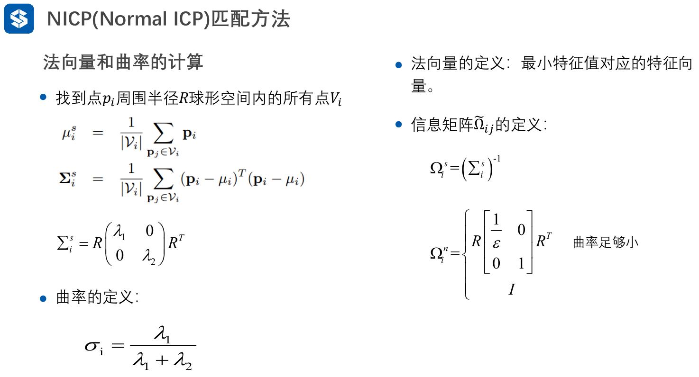
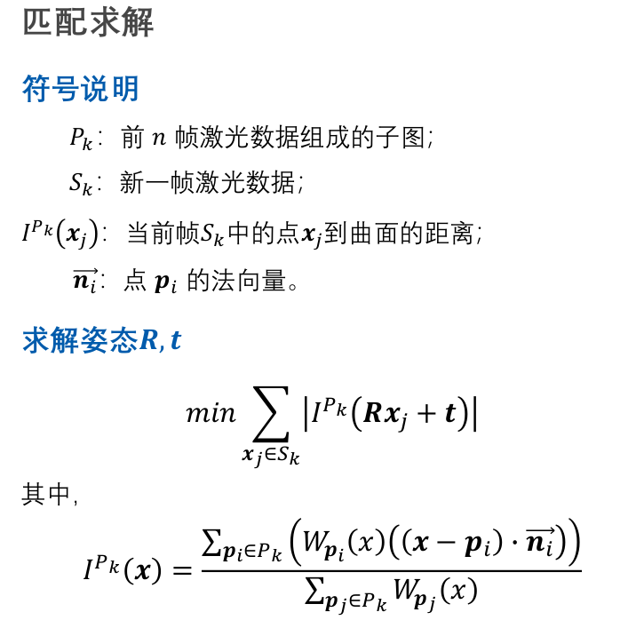

# IMLS-ICP实践

## 一、概述

**基本思想**

​	每次激光扫描时，未必会扫到同一个点，但大概率会扫到同一个平面，因此传统点对点的ICP匹配并不合理，**应该是点与点云所在的曲面进行匹配(点在曲面上)。**

​	对于新一帧点云，利用其所有点云进行匹配，从而求得该帧点云的旋转与平移姿态。这样操作计算量大，同时该帧点云分布不均匀时会导致计算结果出现偏移。**可以考虑选取有代表性的点参与匹配环节。**

### 1、曲面重建

​	我们利用上一帧或者之前n帧的点云进行曲面重建。我们计算当前帧的点在曲面上的投影点。**我们给出曲面表达式：**
$$
P_k：前n帧激光数据组成的子图\\
I^{P_k}(x):R^3空间的点x 到点云集P_k构成的曲面的距离\\
p_i:点云集合P_k中的点\\
n_i:点p_i的法向量\\
\\
曲面表达式:\\
I^{P_k}(x)=\frac{\sum _{p_i \in P_k}
(W_{p_i}(x)((x-p_i)·n_i))}{\sum _{p_i \in P_k} W_{p_j}(x)}\\其中，权重\\
W_{p_i}(x)=e^{-||x-p_i||^2/h^2}\\
点云集合P_k蕴含的曲面：I^{P_k}(x)=0
$$

### 2、优化函数

​	我们想让当前帧点云与之前的曲面匹配，那么我们有：
$$
argmin_{R,t}\sum_{x_j\in S_k}|I^{P_k}(Rx_j+t)|
$$

### 3、求解


## 二、代码详解

### 1、回调函数championLaserScanCallback()

#### i. 步骤一：判断初始状态

```c++
if(m_isFirstFrame == true)
{
    std::cout <<"First Frame"<<std::endl;
    m_isFirstFrame = false;
    m_prevLaserPose = Eigen::Vector3d(0, 0, 0);//上一帧位姿设置为0
    pubPath(m_prevLaserPose, m_imlsPath, m_imlsPathPub);
    ConvertChampionLaserScanToEigenPointCloud(msg, m_prevPointCloud);
    return ;
}
```

#### ii. 步骤二：点云匹配

```c++
//将激光雷达点云信息转换为二维点云(x,y)信息
std::vector<Eigen::Vector2d> nowPts;
ConvertChampionLaserScanToEigenPointCloud(msg, nowPts);

//调用imls进行icp匹配，并输出结果．
//nowPts ： 当前帧点云
//m_prevPointCloud ： 上一帧(上几帧点云组成的)点云
m_imlsMatcher.setSourcePointCloud(nowPts);
m_imlsMatcher.setTargetPointCloud(m_prevPointCloud);

Eigen::Matrix3d rPose,rCovariance;
//匹配开始
if(m_imlsMatcher.Match(rPose,rCovariance))
{
    //匹配后得到的相对上一帧的位姿
    std::cout <<"IMLS Match Successful:"<<rPose(0,2)<<","<<rPose(1,2)<<","<<atan2(rPose(1,0),rPose(0,0))*57.295<<std::endl;
    Eigen::Matrix3d lastPose;
    lastPose << cos(m_prevLaserPose(2)), -sin(m_prevLaserPose(2)), m_prevLaserPose(0),
    sin(m_prevLaserPose(2)),  cos(m_prevLaserPose(2)), m_prevLaserPose(1),
    0, 0, 1;
    //现在的位姿
    Eigen::Matrix3d nowPose = lastPose * rPose;
    m_prevLaserPose << nowPose(0, 2), nowPose(1, 2), atan2(nowPose(1,0), nowPose(0,0));
    pubPath(m_prevLaserPose, m_imlsPath, m_imlsPathPub);
}
else
{
    std::cout <<"IMLS Match Failed!!!!"<<std::endl;
}

m_prevPointCloud = nowPts;
```

### 2、Match函数

#### i. 步骤一：计算法向量



​	我们计算target pointcloud(参考点云)中每个点的法向量	

```c++
//自动计算target pointcloud中每个点的法向量(参考点云)
m_targetPtCloudNormals.clear();
for(int i = 0; i < m_targetPointCloud.size();i++)
{
    Eigen::Vector2d xi = m_targetPointCloud[i];
	
    //寻找参考点云中的点 的 邻近点(通过KNN算法)
    int K = 20;
    Eigen::VectorXi indices(K);
    Eigen::VectorXd dist2(K);
    int num = m_pTargetKDTree->knn(xi,indices,dist2,K,0.0,
                                   Nabo::NNSearchD::SORT_RESULTS | Nabo::NNSearchD::ALLOW_SELF_MATCH|
                                   Nabo::NNSearchD::TOUCH_STATISTICS,
                                   0.15);

    std::vector<Eigen::Vector2d> nearPoints;
    for(int ix = 0; ix < K;ix++)
    {
        if(dist2(ix) < std::numeric_limits<double>::infinity() &&
           std::isinf(dist2(ix)) == false)
        {
            nearPoints.push_back(m_targetKDTreeDataBase.col(indices(ix)));
        }
        else break;
    }

    //计算参考点云中某点的法向量
    Eigen::Vector2d normal;
    if(nearPoints.size() > 3)
    {
        //计算法向量，需要将该点周围邻近点一同输入至函数中
        normal = ComputeNormal(nearPoints);
    }
    else
    {
        normal(0) = normal(1) = std::numeric_limits<double>::infinity();
    }
    m_targetPtCloudNormals.push_back(normal);
}
```

#### ii. 计算法向量ComputeNormal函数

```c++
/**
 * @brief IMLSICPMatcher::ComputeNormal
 * 计算法向量
 * @param nearPoints    某个点周围的所有激光点
 * @return
 */
Eigen::Vector2d IMLSICPMatcher::ComputeNormal(std::vector<Eigen::Vector2d> &nearPoints)
{
    Eigen::Vector2d normal;

    //TODO
    //根据周围的激光点计算法向量，参考ppt中NICP计算法向量的方法
    //式1 计算均值
    int nNearPointsNum = nearPoints.size();
    Eigen::Vector2d ev2dPointSum = Eigen::Vector2d::Zero();
    for(const auto &p:nearPoints)
    {
        ev2dPointSum += p;
    }
    ev2dPointSum /= nNearPointsNum;

    //covirance
    //式2 计算方差
    Eigen::Matrix2d em2dPointCov = Eigen::Matrix2d::Zero();
    for(auto p:nearPoints)
    {
        em2dPointCov += (p-ev2dPointSum)*(p-ev2dPointSum).transpose();
    }
    em2dPointCov /= nNearPointsNum;

    //solve eigen vector and value
    //式3 计算特征值和特征向量，法向量为小特征值对应的特征向量(2D->2维向量)
    Eigen::EigenSolver<Eigen::Matrix2d> es(em2dPointCov);
    Eigen::Vector2d eigenvalues=es.eigenvalues().real();
    Eigen::Matrix2d eigenvectors=es.eigenvectors().real();

    if(eigenvalues(0)<eigenvalues(1))
    {
        normal = eigenvectors.col(0);
    }
    else
    {
        normal = eigenvectors.col(1);
    }

    //end of TODO

    return normal;
}
```

#### iii. 寻找匹配点云

```c++
//初始化估计值．
Eigen::Matrix3d result;
result.setIdentity();
covariance.setIdentity();

for(int i = 0; i < m_Iterations;i++)
{
    //根据当前估计的位姿对原始点云进行转换．
    std::vector<Eigen::Vector2d> in_cloud;
    for(int ix = 0; ix < m_sourcePointCloud.size();ix++)
    {
        Eigen::Vector3d origin_pt;
        origin_pt << m_sourcePointCloud[ix],1;

        Eigen::Vector3d now_pt = result * origin_pt;
        in_cloud.push_back(Eigen::Vector2d(now_pt(0),now_pt(1)));
    }

    //把sourceCloud中的点投影到targetCloud组成的平面上
    //对应的投影点即为sourceCloud的匹配点．
    //每次转换完毕之后，都需要重新计算匹配点．
    //这个函数会得到对应的匹配点．
    //本次匹配会自动删除in_cloud内部的一些找不到匹配点的点．
    //因此，这个函数出来之后，in_cloud和ref_cloud是一一匹配的．
    std::vector<Eigen::Vector2d> ref_cloud;
    std::vector<Eigen::Vector2d> ref_normal;
    projSourcePtToSurface(in_cloud,
                          ref_cloud,
                          ref_normal);
```

#### iv. projSourcePtToSurface函数

```c++
/**
 * @brief IMLSICPMatcher::projSourcePtToSurface
 * 此函数的目的是把source_cloud中的点云，投影到对应的surface上．
   即为每一个当前帧点云in_cloud的激光点计算匹配点和对应的法向量
   即in_cloud和out_cloud进行匹配，同时得到out_normal
   注意：本函数应该删除in_cloud内部找不到匹配值的点．
 * @param in_cloud          当前帧点云
 * @param out_cloud         当前帧的匹配点云
 * @param out_normal        匹配点云对应的法向量．
 */
void IMLSICPMatcher::projSourcePtToSurface(
        std::vector<Eigen::Vector2d> &in_cloud,
        std::vector<Eigen::Vector2d> &out_cloud,
        std::vector<Eigen::Vector2d> &out_normal)
{
    out_cloud.clear();
    out_normal.clear();

    for(std::vector<Eigen::Vector2d>::iterator it = in_cloud.begin(); it != in_cloud.end();)
    {
        Eigen::Vector2d xi = *it;

        //找到在target_cloud中的最近邻
        //包括该点和下标．
        int K = 1;
        Eigen::VectorXi indices(K);
        Eigen::VectorXd dist2(K);
        m_pTargetKDTree->knn(xi,indices,dist2);

        Eigen::Vector2d nearXi = m_targetKDTreeDataBase.col(indices(0));

        //为最近邻计算法向量．－－进行投影的时候，使用统一的法向量．
        Eigen::Vector2d nearNormal = m_targetPtCloudNormals[indices(0)];

        //如果对应的点没有法向量，也认为没有匹配点．因此直接不考虑．
        if(std::isinf(nearNormal(0))||std::isinf(nearNormal(1))||
                std::isnan(nearNormal(0))||std::isnan(nearNormal(1)))
        {
            it = in_cloud.erase(it);
            continue;
        }

        //如果距离太远，则说明没有匹配点．因此可以不需要进行投影，直接去除．
        if(dist2(0) > m_h * m_h )
        {
            it = in_cloud.erase(it);
            continue;
        }

        //进行匹配
        double height;
        if(ImplicitMLSFunction(xi,height) == false)
        {
            it = in_cloud.erase(it);
            continue;
        }

        if(std::isnan(height))
        {
            std::cout <<"proj:this is not possible"<<std::endl;
            it = in_cloud.erase(it);
            continue;
        }

        if(std::isinf(height))
        {
            std::cout <<"proj:this is inf,not possible"<<std::endl;
            it = in_cloud.erase(it);
            continue;
        }

        Eigen::Vector2d yi;
        //TODO
        //计算yi．
        yi = xi -height*nearNormal;
        //end of TODO
        out_cloud.push_back(yi);
        out_normal.push_back(nearNormal);

        it++;
    }
}
```


#### v. ImplictMLSFunction函数



```c++
//IMLS函数，主要用来进行曲面投影．
//可以认为是xi在曲面上的高度．
//用target_sourcePtcloud构造一个kd树．

//xi为当前帧中的一个点
bool IMLSICPMatcher::ImplicitMLSFunction(Eigen::Vector2d x,
                                         double& height)
{
    double weightSum = 0.0;
    double projSum = 0.0;

    //创建KD树
    if(m_pTargetKDTree == NULL)
    {
        m_targetKDTreeDataBase.resize(2,m_targetPointCloud.size());
        for(int i = 0; i < m_targetPointCloud.size();i++)
        {
            m_targetKDTreeDataBase(0,i) = m_targetPointCloud[i](0);
            m_targetKDTreeDataBase(1,i) = m_targetPointCloud[i](1);
        }
        m_pTargetKDTree = Nabo::NNSearchD::createKDTreeLinearHeap(m_targetKDTreeDataBase);
    }

    // 找到位于点x附近(m_r)的所有的点云
    int searchNumber = 20;
    Eigen::VectorXi nearIndices(searchNumber);
    Eigen::VectorXd nearDist2(searchNumber);

    //找到某一个点的最近邻．
    //搜索searchNumber个最近邻
    //下标储存在nearIndices中，距离储存在nearDist2中．
    //最大搜索距离为m_r
    m_pTargetKDTree->knn(x,nearIndices,nearDist2,searchNumber,0,
                         Nabo::NNSearchD::SORT_RESULTS | Nabo::NNSearchD::ALLOW_SELF_MATCH|
                         Nabo::NNSearchD::TOUCH_STATISTICS,
                         m_h);

    std::vector<Eigen::Vector2d> nearPoints;
    std::vector<Eigen::Vector2d> nearNormals;
    for(int i = 0; i < searchNumber;i++)
    {
        //说明最近邻是合法的．
        if(nearDist2(i) < std::numeric_limits<double>::infinity() &&
                std::isinf(nearDist2(i)) == false &&
                std::isnan(nearDist2(i)) == false)
        {
            //该最近邻在原始数据中的下标．
            int index = nearIndices(i);

            Eigen::Vector2d tmpPt(m_targetKDTreeDataBase(0,index),m_targetKDTreeDataBase(1,index));

            //是否为inf
            if(std::isinf(tmpPt(0))||std::isinf(tmpPt(1))||
                    std::isnan(tmpPt(0))||std::isnan(tmpPt(1)))
            {
                continue;
            }

            Eigen::Vector2d normal;
            normal = m_targetPtCloudNormals[index];

            //如果对应的点没有法向量，则不要．
            if(std::isinf(normal(0))||std::isinf(normal(1))||
                    std::isnan(normal(0))||std::isnan(normal(1)))
            {
                continue;
            }

            nearPoints.push_back(tmpPt);
            nearNormals.push_back(normal);
        }
        else
        {
            break;
        }
    }

    //如果nearPoints小于３个，则认为没有匹配点．
    if(nearPoints.size() < 3)
    {
        return false;
    }

    //TODO
    //根据函数进行投影．计算height，即ppt中的I(x)
    double sumw=0.0;
    double sumproject=0.0;
    int nNearPointsNum = nearPoints.size();
    for(int i=0;i<nNearPointsNum;i++)
    {
        //weight
        Eigen::Vector2d pi = nearPoints[i];
        Eigen::Vector2d ni = nearNormals[i];

        Eigen::Vector2d x_pi = Eigen::Vector2d::Zero();
        x_pi=x-pi;
        double normxpi=-x_pi.squaredNorm()/m_h/m_h;
        double w = exp(normxpi);

        double project = w*x_pi.dot(ni);
        sumw+=w;
        sumproject+=project;
    }
    height = sumproject/(sumw+0.000001);
    //end of TODO

    return true;
}
```

#### vi 计算帧间位移(相对位姿)

```c++
//计算帧间位移．从当前的source -> target
Eigen::Matrix3d deltaTrans;
bool flag = SolveMotionEstimationProblem(in_cloud,
                                         ref_cloud,
                                         ref_normal,
                                         deltaTrans);
```


