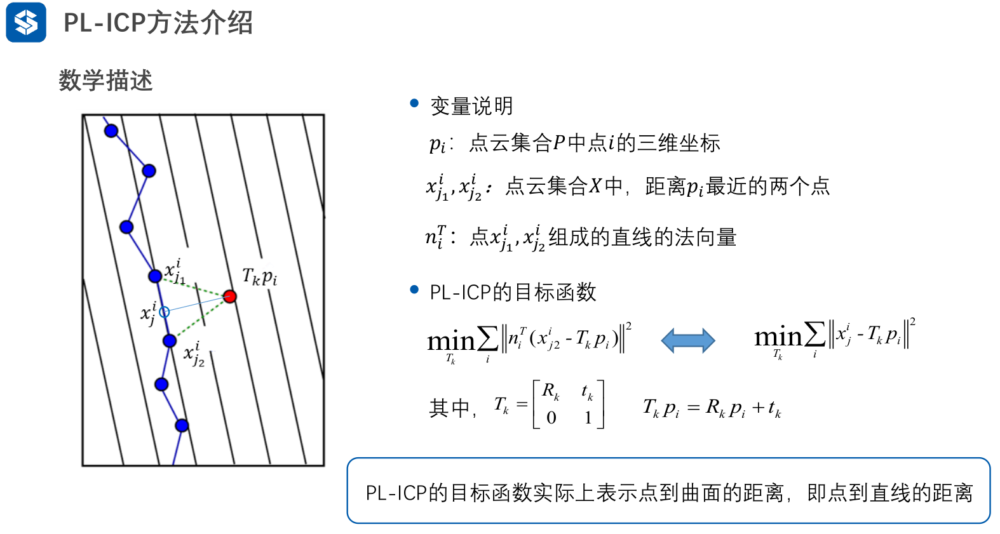
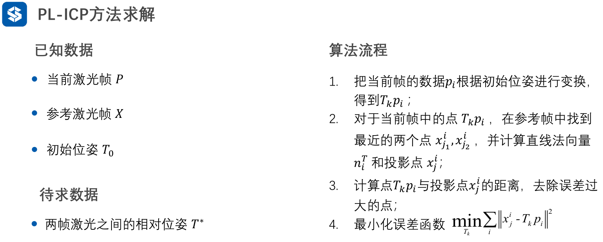
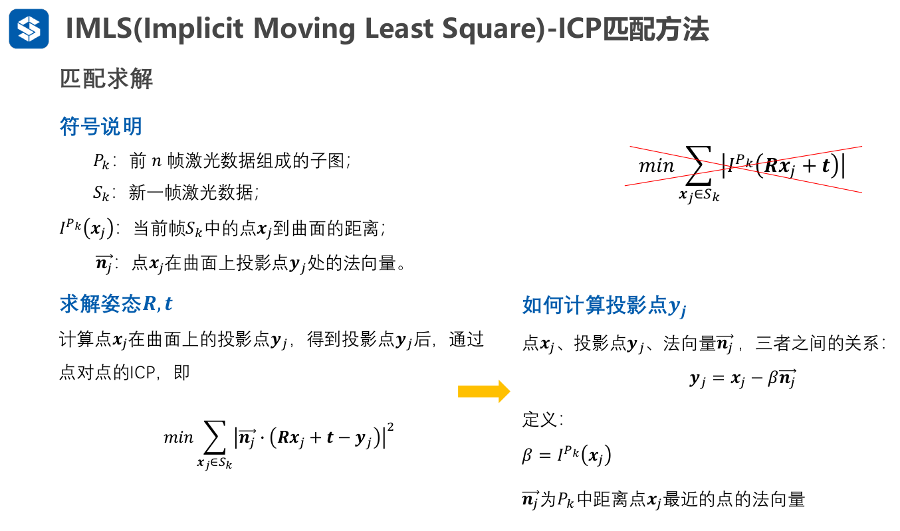

# 激光雷达前端匹配算法

## 一、ICP

## 二、PL-ICP

### 1、概述

​	视觉SLAM中，我们说：**路标点在很多帧投影下，像素坐标如下所示**
$$
p_{ref}为路标点\\
x_{pixel}=KT_{cw}p_{ref}\\
相机坐标系下，我们可以用K来得到点的像素坐标\\
$$
这样：我们最小化这个误差做最小二乘即可得到Tcw

​	激光SLAM中，激光扫描可以看作对曲面进行采样得到点数据，**但是曲面是真实存在的，就像视觉SLAM中的路标点一样。而机器人的坐标变换导致采样点变化(如同相机坐标系变换，得到的像素坐标变化)，这样，我们最小化当前帧与前一帧的构成的曲面的最小距离，即认为当前帧也在上一帧构成的曲面中。**

### 2、数学描述

问题：如果出现新的曲面如何处理？？？

可以把误差较大的去掉。即出现新曲面时候，与原曲面采样点肯定会比较远。

### 3、算法流程

### 4、算法特点及优缺点

**跟ICP算法的区别**

1. 误差函数形式不同，ICP为点对点的距离作为误差，PL-ICP为点到线的距离作为误差；PL-ICP的误差形式更符合实际情况
2. 收敛速度不同，ICP为一阶收敛，PL-ICP为二阶收敛
3. PL-ICP的求解精度高于ICP，特别是在结构化环境中
4. PL-ICP对初始值更敏感；**不单独使用，一般与里程计、CSM等一起使用**

## 三、NICP

## 四、IMLS-ICP

**基本思想**

​	每次激光扫描时，未必会扫到同一个点，但大概率会扫到同一个平面，因此传统点对点的ICP匹配并不合理，**应该是点与点云所在的曲面进行匹配(点在曲面上)。**

​	对于新一帧点云，利用其所有点云进行匹配，从而求得该帧点云的旋转与平移姿态。这样操作计算量大，同时该帧点云分布不均匀时会导致计算结果出现偏移。**可以考虑选取有代表性的点参与匹配环节。**

### 1、曲面重建

​	我们利用上一帧或者之前n帧的点云进行曲面重建。我们计算当前帧的点在曲面上的投影点。**我们给出曲面表达式：**
$$
P_k：前n帧激光数据组成的子图\\
I^{P_k}(x):R^3空间的点x 到点云集P_k构成的曲面的距离\\
p_i:点云集合P_k中的点\\
n_i:点p_i的法向量\\
\\
曲面表达式:\\
I^{P_k}(x)=\frac{\sum _{p_i \in P_k}
(W_{p_i}(x)((x-p_i)·n_i))}{\sum _{p_i \in P_k} W_{p_j}(x)}\\其中，权重\\
W_{p_i}(x)=e^{-||x-p_i||^2/h^2}\\
点云集合P_k蕴含的曲面：I^{P_k}(x)=0
$$

### 2、优化函数

​	我们想让当前帧点云与之前的曲面匹配，那么我们有：
$$
argmin_{R,t}\sum_{x_j\in S_k}|I^{P_k}(Rx_j+t)|
$$

### 3、求解

