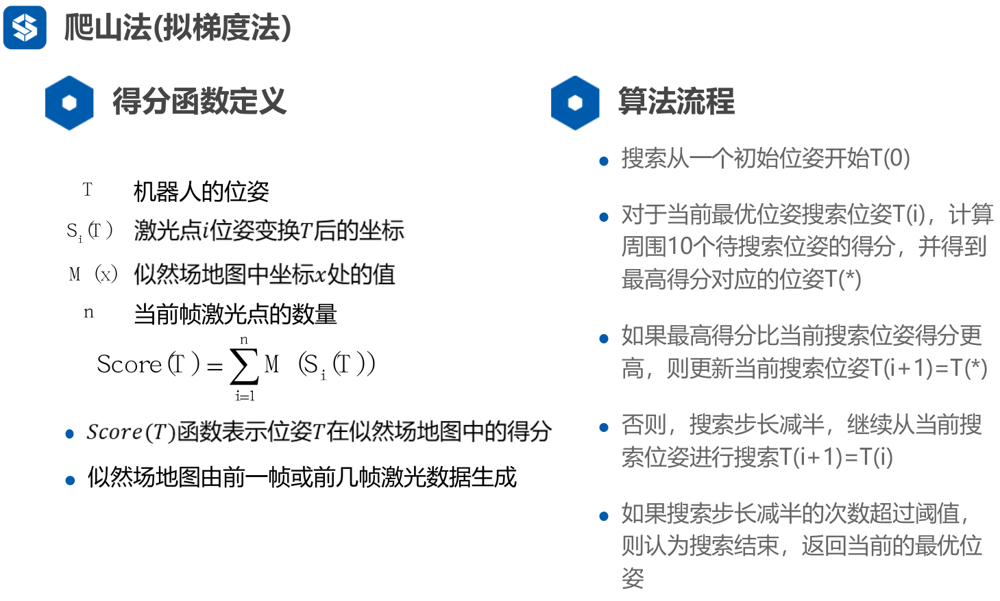
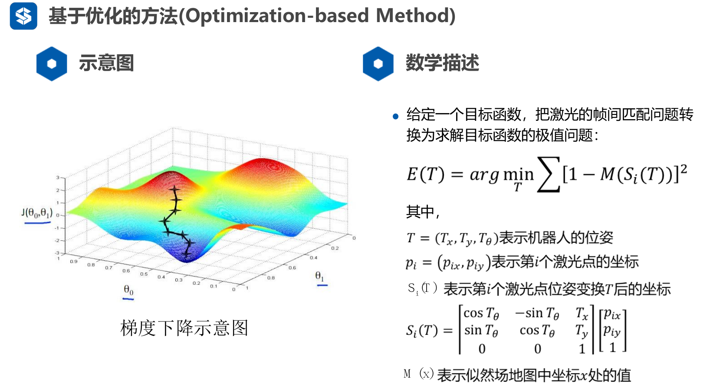

# 基于优化的前端

## 一、爬山法(拟梯度法)

​	我们从一个初始位姿开始优化，激光点云经过这个位姿变换可以变换成似然场地图(世界坐标系)下的坐标，这样，我们可以对每个点打分(在不在边缘或曲面上)，再逐一搜索得到最优解。

### 1、基本思想

### 2、算法流程

## 二、高斯牛顿优化方法

### 1、概述

这里的M和上述的Score(T)很类似。此处我们想要M(x)最大，但一般优化问题都是求最小值，因此我们求1-M的最小值(M的最大值为1，可以视作一种概率)。

### 2、求解

​	我们现在要求M的导数和T对S的导数。M是不连续的，因此我们需要进行**双线性插值**，得到插值函数。

## 三、NDT法

## 四、相关匹配方法及分支定界加速